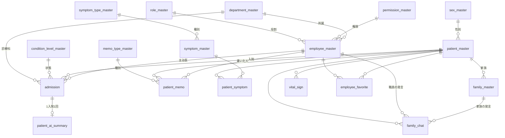

# めっちゃかんご v2 データ設計（DOA）

v2 で使うテーブルの設計書です。まだ SQL も画面も作っていません。この内容で OK が出てから作ります。

---

## 1. 設計のルール

| ルール | 内容 |
|---|---|
| v1 のテーブルは触らない | `patients` `records` `chat_messages` `ai_summaries` `appointments` `nurse_accounts` `family_accounts` `watch_status` はそのまま残す。v2 は新しいテーブルだけを使う。DROP・ALTER は一切しない |
| 数値で管理 | ID・区分・フラグはすべて数値。文字で持つのは「名前・本文・メールアドレス」のように、数値にできないものだけ |
| 削除は delete_flag | すべてのテーブルに `delete_flag`（0 = 有効、1 = 削除済み）を持たせる。行は消さず、画面には 0 の行だけを出す |
| 共通の列 | すべてのテーブルに `delete_flag` `created_at`（作成日時）`updated_at`（更新日時）を付ける。マスタには、表示順を決める `sort_order` も付ける |
| 名前の付け方 | マスタは `〇〇_master`。それ以外は、何の記録かがわかる名前にする（v1 と紛らわしい名前は避ける） |
| 区分もマスタにする | 性別・状態などの区分も小さなマスタにして、外部キーでつなぐ。理由は 3 つ。① ありえない数値が入らない ② Supabase で `select=*,sex_master(sex_name)` のように名前をまとめて取れる ③ 区分が増えても行を足すだけで済み、画面のコードを直さなくてよい |

---

## 2. 全体図

| 分類 | テーブル |
|---|---|
| 区分マスタ（決まった値の一覧） | `sex_master` `symptom_type_master` `condition_level_master` `memo_type_master` |
| 管理マスタ（管理者が増やす一覧） | `role_master` `permission_master` `department_master` `symptom_master` |
| 人のマスタ | `employee_master` `patient_master` `family_master` |
| 記録（日々増えるデータ） | `admission` `patient_symptom` `patient_memo` `patient_ai_summary` `employee_favorite` `family_chat` `vital_sign` |

---

## 3. テーブル定義

共通の列（`delete_flag` `created_at` `updated_at`。マスタは `sort_order` も）は、各表から省略しています。

### 3-1. 区分マスタ

**sex_master（性別）** … 番号は国際規格 ISO 5218 に合わせる

| 列 | 型 | 内容 |
|---|---|---|
| sex_id | smallint PK | 0 不明 / 1 男性 / 2 女性 / 9 その他 |
| sex_name | text | 表示名 |

**symptom_type_master（症状の種別）**

| 列 | 型 | 内容 |
|---|---|---|
| symptom_type_id | smallint PK | 1 診断名 / 2 アレルギー / 3 既往歴 |
| symptom_type_name | text | 表示名 |

**condition_level_master（患者の状態）** … v1 の flag（high/mid/low）を数値にしたもの

| 列 | 型 | 内容 |
|---|---|---|
| condition_level_id | smallint PK | 1 安定 / 2 要観察 / 3 要注意（数字が大きいほど注意が必要） |
| condition_level_name | text | 表示名 |

**memo_type_master（メモの種別）**

| 列 | 型 | 内容 |
|---|---|---|
| memo_type_id | smallint PK | 1 申し送り / 2 プライベート |
| memo_type_name | text | 表示名 |

### 3-2. 管理マスタ

**role_master（役割 ＝ 職種）**

| 列 | 型 | 内容 |
|---|---|---|
| role_id | smallint PK | 1 医師 / 2 看護師 / 3 准看護師 / 4 看護助手 / 5 薬剤師 / 6 理学療法士 / 7 管理栄養士 / 8 医療事務 |
| role_name | text | 表示名 |

**permission_master（権限）** … できることを 0/1 の列で持つ

| 列 | 型 | 内容 |
|---|---|---|
| permission_id | smallint PK | 1 管理者 / 2 一般 |
| permission_name | text | 表示名 |
| can_patient_create | smallint 0/1 | 患者の新規登録 |
| can_patient_update | smallint 0/1 | 患者情報の修正 |
| can_patient_delete | smallint 0/1 | 患者の削除（delete_flag を 1 にする） |
| can_employee_manage | smallint 0/1 | 職員の登録・修正・削除 |
| can_master_manage | smallint 0/1 | 分野・症状などのマスタの編集 |

管理者は全部 1、一般は全部 0 にする。

**department_master（分野 ＝ 診療科）**

| 列 | 型 | 内容 |
|---|---|---|
| department_id | smallint PK | 1 内科 / 2 外科 / 3 整形外科 / 4 循環器内科 / 5 呼吸器内科 / 6 消化器内科 / 7 脳神経外科 / 8 リハビリテーション科 |
| department_name | text | 表示名 |

**symptom_master（症状 ＝ 診断名・アレルギー・既往歴）**

| 列 | 型 | 内容 |
|---|---|---|
| symptom_id | integer PK（自動採番） | |
| symptom_type_id | smallint FK | どの種別か（診断名・アレルギー・既往歴） |
| symptom_name | text | 例：肺炎、ペニシリン、高血圧 |

同じ種別の中では、同じ名前を登録できないようにする。

### 3-3. 人のマスタ

**employee_master（職員）**

| 列 | 型 | 内容 |
|---|---|---|
| employee_id | bigint PK（自動採番） | 内部で使う番号 |
| employee_no | integer UNIQUE | 職員番号。ログイン ID になる（例：10001） |
| employee_name | text | 氏名 |
| employee_kana | text | ふりがな（並べ替え・検索用） |
| password_hash | text | パスワードをそのまま保存せず、ブラウザで変換（SHA-256）した値を保存する |
| role_id | smallint FK | 役割（医師・看護師など） |
| permission_id | smallint FK | 権限（管理者・一般） |
| department_id | smallint FK（空でも可） | 所属する分野 |

**patient_master（患者 ＝ 変わらない情報）**

| 列 | 型 | 内容 |
|---|---|---|
| patient_id | bigint PK（自動採番） | 内部で使う番号 |
| patient_no | integer UNIQUE | 患者番号。家族がログインするときの「患者 ID」になる（例：100001） |
| patient_name | text | 氏名 |
| patient_kana | text | ふりがな |
| birth_date | date | 生年月日。年齢は保存せず、生年月日から計算する |
| sex_id | smallint FK | 性別 |

**family_master（家族）**

| 列 | 型 | 内容 |
|---|---|---|
| family_id | bigint PK（自動採番） | |
| patient_id | bigint FK | どの患者の家族か |
| email | text | メールアドレス |
| password_hash | text | パスワード（変換した値） |
| last_login_at | timestamptz | 最後にログインした日時 |

同じ患者に、同じメールアドレスは 1 つしか登録できない。

### 3-4. 記録

**admission（入院記録）** … 入院ごとに 1 行。退院済みの行は、そのまま「入院歴」になる

| 列 | 型 | 内容 |
|---|---|---|
| admission_id | bigint PK | |
| patient_id | bigint FK | |
| department_id | smallint FK | 診療科 |
| doctor_employee_id | bigint FK（空でも可） | 主治医 |
| room_no | integer | 部屋番号（例：203） |
| admitted_on | date | 入院日 |
| discharged_on | date（空でも可） | 退院日。空なら入院中 |
| condition_level_id | smallint FK | 今の状態（安定・要観察・要注意） |
| care_note | text | 注意事項（例：転倒リスクあり） |

1 人の患者が同時に「入院中」になれるのは 1 件だけ、という制約をかける。

**patient_symptom（患者と症状の紐付け）**

| 列 | 型 | 内容 |
|---|---|---|
| patient_symptom_id | bigint PK | |
| patient_id | bigint FK | |
| symptom_id | integer FK | |
| admission_id | bigint FK（空でも可） | 診断名は入院に紐付ける。アレルギーと既往歴は空にする |
| onset_on | date（空でも可） | 診断日・発症日。AI 要約の【病歴】に使う |
| note | text | 補足 |

**patient_memo（申し送りメモ・プライベートメモ）** … 2 種類のメモを 1 つのテーブルにまとめる

| 列 | 型 | 内容 |
|---|---|---|
| memo_id | bigint PK | |
| patient_id | bigint FK | |
| admission_id | bigint FK（空でも可） | どの入院中のメモか |
| memo_type_id | smallint FK | 1 申し送り / 2 プライベート |
| content | text | 本文（自由記述のみ） |
| family_visible | smallint 0/1 | 1 なら家族の画面にも出す（v1 の「家族に送る」ボタン） |
| employee_id | bigint FK | 書いた人 |

**patient_ai_summary（AI 要約の保存）**

| 列 | 型 | 内容 |
|---|---|---|
| ai_summary_id | bigint PK | |
| admission_id | bigint FK UNIQUE | 1 回の入院につき 1 行。今は何回でも作り直せる設定で、作り直すとこの行を新しい文章で上書きする（`AI_SUMMARY_ONCE` を true にすると 1 回だけになる） |
| patient_id | bigint FK | |
| generated_text | text | AI が出した文章（あとから変えない） |
| edited_text | text（空でも可） | 職員が手直しした最新版。画面にはこちらを優先して出す |
| family_visible | smallint 0/1 | 家族の画面にも出すか |
| generated_by | bigint FK | 要約ボタンを押した職員 |
| generated_at | timestamptz | 要約した日時 |
| updated_by | bigint FK（空でも可） | 最後に手直しした職員 |

**employee_favorite（お気に入り）**

| 列 | 型 | 内容 |
|---|---|---|
| employee_id | bigint FK | どの職員の |
| patient_id | bigint FK | どの患者を |

この 2 列の組み合わせを主キーにする。お気に入りを外すときは delete_flag を 1 にし、もう一度付けるときは 0 に戻す。

**family_chat（職員と家族のメッセージ）**

| 列 | 型 | 内容 |
|---|---|---|
| chat_id | bigint PK | |
| patient_id | bigint FK | どの患者についての会話か |
| employee_id | bigint FK（空でも可） | 職員が送ったときに入れる |
| family_id | bigint FK（空でも可） | 家族が送ったときに入れる |
| body | text | 本文 |
| read_flag | smallint 0/1 | 相手が読んだか |

employee_id と family_id は、必ずどちらか一方だけに値を入れる。そうすれば「送り主の種別」の列はいらない。

**vital_sign（バイタル）** ※使わないことになったので、画面からは外しました（テーブルとデータは残しています）

| 列 | 型 | 内容 |
|---|---|---|
| vital_id | bigint PK | |
| patient_id | bigint FK | |
| admission_id | bigint FK | |
| measured_at | timestamptz | 測った日時 |
| body_temp | numeric(3,1) | 体温（例：36.8） |
| bp_systolic / bp_diastolic | smallint | 血圧（上・下） |
| pulse | smallint | 脈拍 |
| spo2 | smallint | 酸素飽和度 |
| resp_rate | smallint | 呼吸数 |
| employee_id | bigint FK | 測った人 |

---

## 4. 権限

| 操作 | 管理者 | 一般 |
|---|:-:|:-:|
| 患者の新規登録・入院登録 | ○ | × |
| 患者情報・入院情報・症状の修正 | ○ | × |
| 患者の削除（delete_flag を 1 にする） | ○ | × |
| 職員の登録・修正・削除 | ○ | × |
| マスタ（分野・症状など）の編集 | ○ | × |
| 状態（安定・要観察・要注意）の変更 | ○ | ○ ※1 |
| メモの追加 | ○ | ○ |
| メモの削除 | ○ | × ※2 |
| AI 要約（今は何回でも作り直せる）・手直し | ○ | ○ |
| お気に入り（自分の分だけ） | ○ | ○ |
| 家族とのチャット | ○ | ○ |

- ※1 状態は毎日変わる情報なので、一般の職員も変えられるようにしています。管理者だけにしたい場合は、そうします。
- ※2 看護記録は、あとから書き換えないのが基本です。そのためメモは追記だけにして、削除は管理者だけが行います。

---

## 5. ログイン

| 誰が | 入力するもの | 動き |
|---|---|---|
| 職員 | 職員番号 ＋ パスワード | `employee_master` と照合する。自分で新規登録はできない（管理者が登録する） |
| 家族 | 患者 ID ＋ パスワード ＋ メールアドレス | 患者 ID で患者を探す。そのメールアドレスが初めてなら、その場で登録する。2 回目からはパスワードを照合する。メールの確認（認証）はしない |

最初の管理者が 1 人いないと誰もログインできないので、初期データとして管理者を 1 人入れておきます。

---

## 6. 画面で使うテーブル

| 画面 | 使うテーブル |
|---|---|
| ログイン | employee_master, family_master, patient_master |
| 患者一覧 | patient_master, admission, condition_level_master, employee_favorite（お気に入りを上に並べる） |
| 患者詳細 | patient_master, admission, patient_symptom, symptom_master, patient_memo, patient_ai_summary, family_chat |
| 管理（管理者だけ） | 患者の登録・編集・削除 / 職員管理 / マスタ管理 |
| 家族 | patient_master, patient_memo（family_visible が 1 のもの）, patient_ai_summary（family_visible が 1 のもの）, family_chat |

AI 要約には、`patient_master` `admission`（入院歴）`patient_symptom`（病歴）`patient_memo`（申し送り）をまとめて渡します。v1 の【病歴・入院歴・治療歴】のひな形に沿って書かせます。

---

## 7. 依頼から変えたところ・付け足したところ

1. **役割と権限を分けた** … 「看護師だけど管理者」「医師だけど一般」のような組み合わせを作れるようにするため。
2. **申し送りメモとプライベートメモを 1 つのテーブルにまとめた** … 列が同じなので、種別の列で分けるだけで済む。症状マスタと同じ考え方。メモの種類を増やすときも、行を足すだけでよい。
3. **AI 要約は 1 回の入院につき 1 行** … 同じ入院で 2 件目は保存できない作り。今は「何回でも作り直せる」設定で、作り直すとその行を上書きする。設定（`AI_SUMMARY_ONCE`）を変えれば「1 回だけ」に戻せる。
4. **AI の原文と手直し版を分けて保存する** … AI が何を書いたかを、あとから確認できる。
5. **患者 ID と職員 ID を数値にした** … v1 の `IIZ0001` のような文字の ID はやめた。
6. **パスワードを変換して保存する** … v1 はパスワードをそのまま保存していた。
7. ~~バイタルを追加した~~ … 使わないことになったので、画面から外した（テーブルは残している）。

---

## 8. 次にやること（OK が出たら）

1. `v2/db/schema.sql` を作る。中身は CREATE TABLE と初期データだけで、v1 のテーブルには触れない。
2. その SQL を Supabase の **SQL Editor** に貼り付けて実行してもらう。今使っている公開キー（anon key）では、テーブルを新しく作れないため。
3. v1 の患者データを v2 のテーブルにコピーして、初期データにする（v1 側はそのまま）。
4. ChatGPT の見た目を参考に、v2 の画面を作る。

> 注意：今の仕組み（anon key でそのまま読み書きする）では、権限の制限は画面の中だけのものです。本番で使う場合は、Supabase Auth と RLS（行ごとのアクセス制限）に切り替える必要があります。
